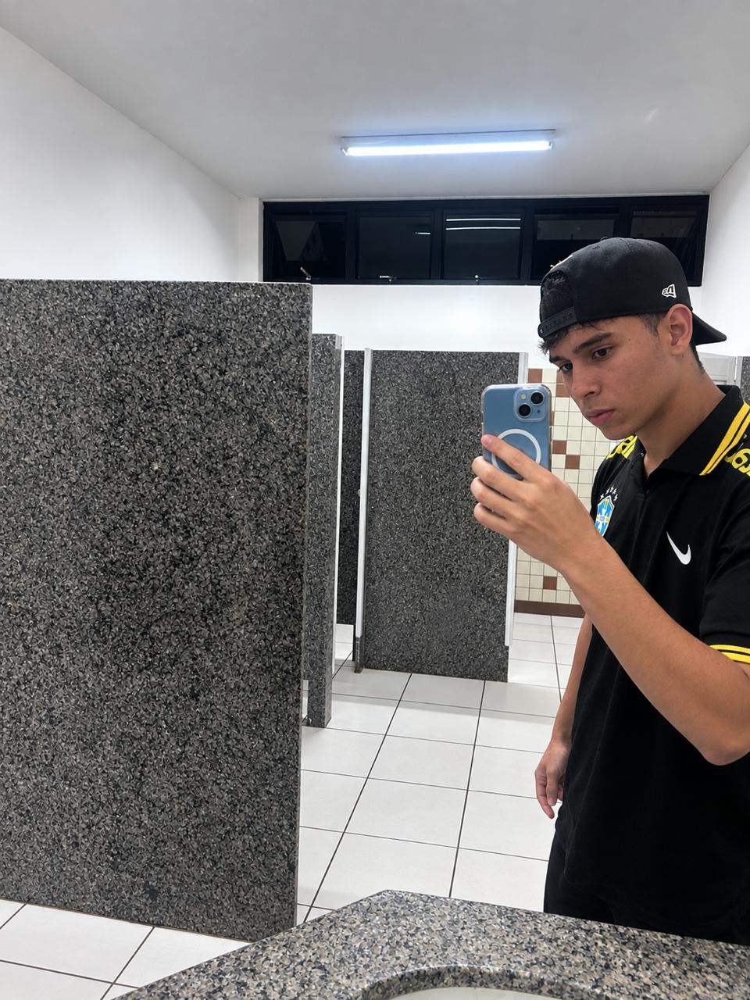

  

<h1 align="center">Olá, eu sou o Kauan Victor 👋</h1>

  

---

### 🎓 Sobre mim

- 🖥️ Atualmente cursando **Engenharia de Software** na **Unifran (Universidade de Franca)**
- 📚 Estou no **2° semestre** do curso
- 💼 Tenho experiência profissional na área de **Vendas**
- 🌍 Nível de inglês: **Intermediário**, aprendido de forma **independente/autodidata**
- 🚀 Em transição de carreira, unindo experiência comercial com conhecimento técnico em tecnologia
- 💡 Interessado em desenvolvimento de software, lógica de programação e tecnologia no geral

---

### 🛠️ Habilidades e Interesses

  
  
  
  

---

### 📈 Objetivos

- Aprofundar conhecimentos em programação e desenvolvimento de sistemas
- Aplicar minha experiência em vendas em áreas como tecnologia comercial, atendimento e negócios digitais
- Evoluir meu inglês para nível avançado
- Construir projetos práticos ao longo da graduação

---

### 📫 Como me encontrar

  

---

  

